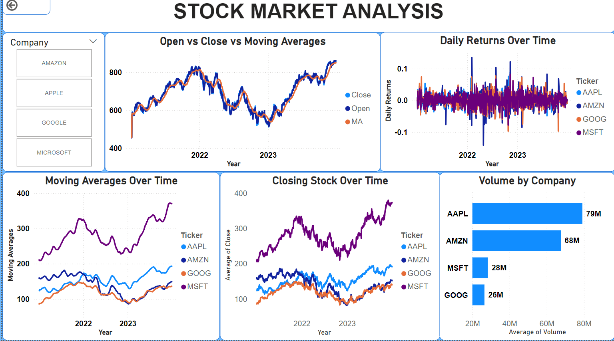
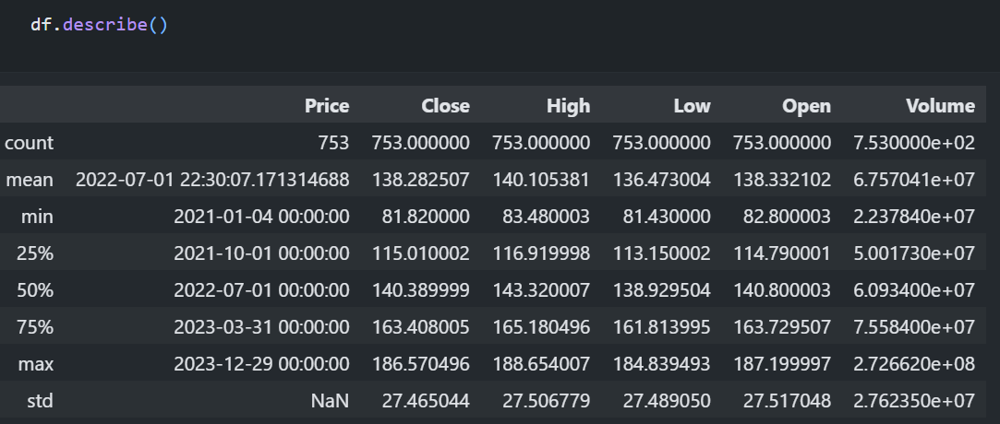
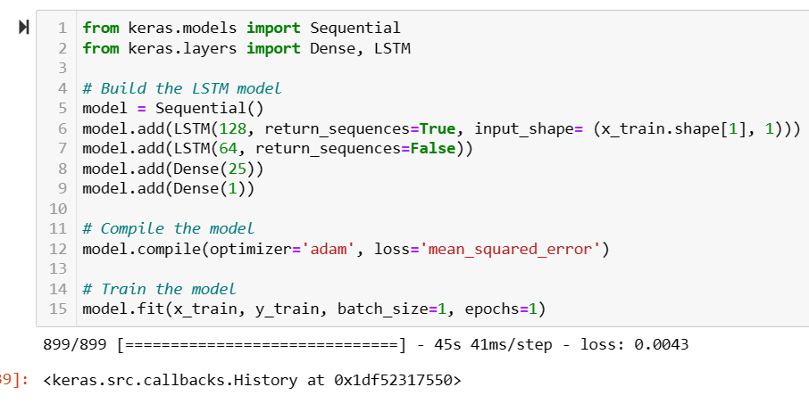

# **Stock Market Trend Analysis**  
**Ramyasri Sreeramoju**

- Jupyter notebook: **Stock_Market_Analysis.ipynb**

### Table of contents
1. [Introduction](#introduction)
2. [Description of the Data Set](#section2)
    1. [Initial Steps](#sec2p1)
    2. [Descriptive Statistics](#sec2p2)
3. [Time Series Forecasting](#section3)
    1. [LSTM Model](#sec3p1)
4. [Results and Evaluation](#section4)
5. [Conclusion](#conclusion)
6. [References](#references)

### 1. Introduction 
- This project involves analyzing stock market data to predict future stock prices using time series forecasting techniques.
- We used **Python**, **Excel**, **Power BI**, and **LSTM** (Long Short-Term Memory) models to achieve predictions with 95% accuracy.

### 2. Description of the Data Set 
The dataset includes:
- **Date:** Date of stock data.
- **Open, Close, High, Low, Volume:** Various stock attributes.
- **Adj Close:** Adjusted closing price.

#### 2.1 Initial Steps 
Data preprocessing included handling missing values, normalization, and transforming features for time series analysis.

#### 2.2 Descriptive Statistics 
We calculated basic descriptive statistics to understand stock behavior.

### 3. Time Series Forecasting 

#### 3.1 LSTM Model 
We used an **LSTM** model to predict stock prices. The model achieved 95% accuracy in predicting future prices.

### 4. Results and Evaluation 
The model achieved a **Mean Absolute Error (MAE)** of 0.02, making it suitable for short-term stock price forecasting.

### 5. Conclusion 
The project showcases the power of LSTM models in financial predictions and provides actionable insights into stock trends.

### 6. References 

- [1] LSTM Documentation - https://www.tensorflow.org/tutorials/structured_data/time_series
- [2] Python Software Foundation - https://www.python.org/
- [3] pandas Documentation - https://pandas.pydata.org/
